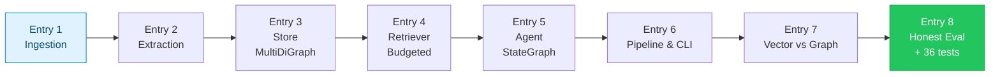
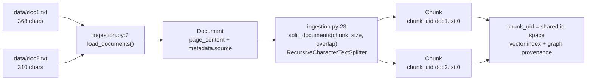
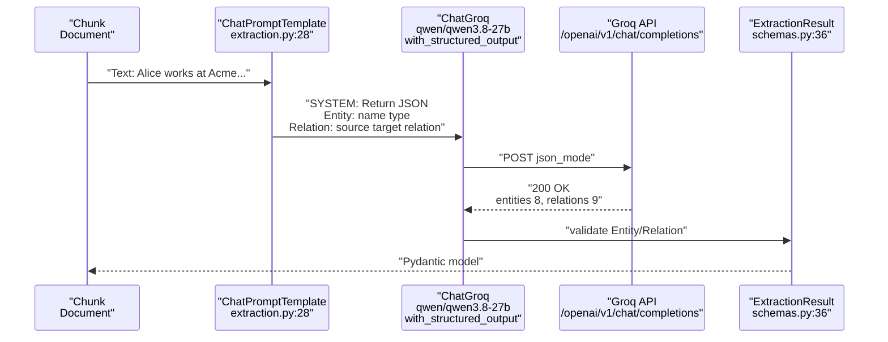
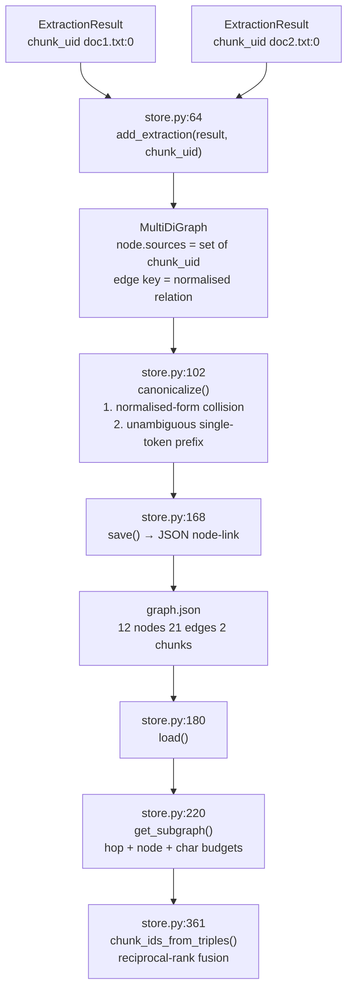
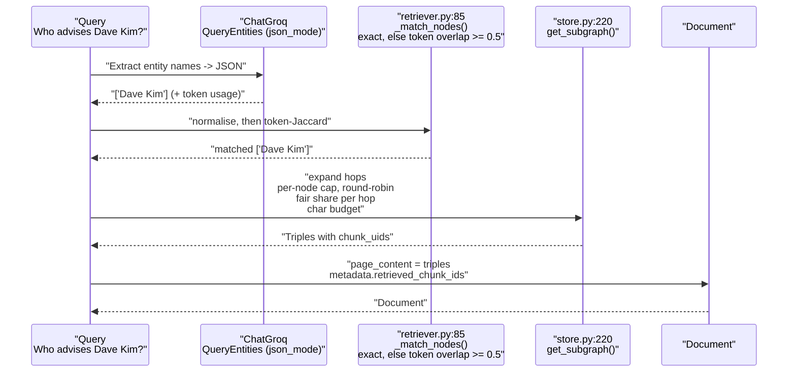
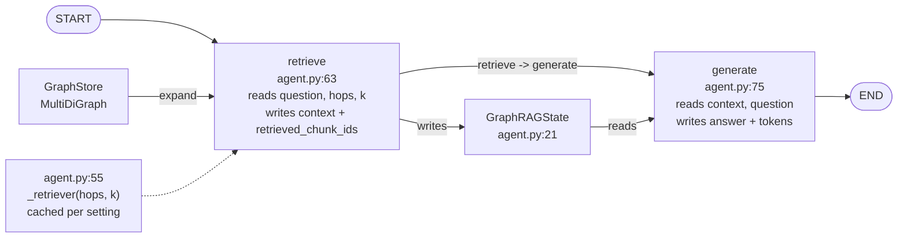
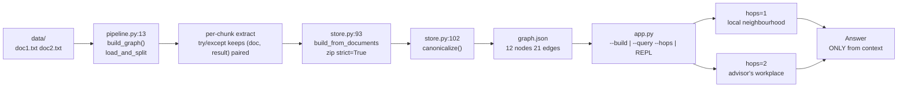
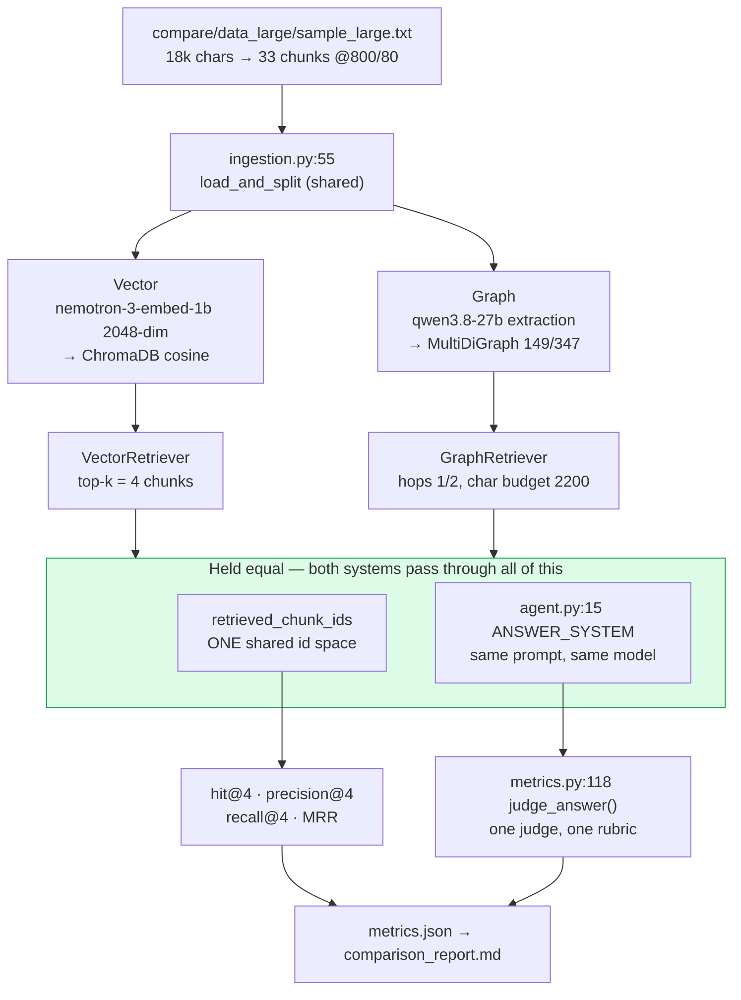
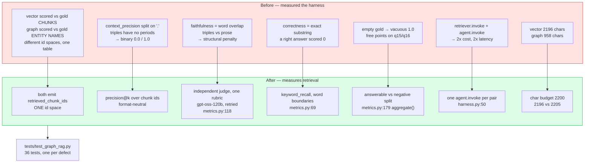

# Graph RAG Learnings — Progress Log
Format: **Concept → Simple explanation → What we built → Result**
**Status:** Entry 1 ✅ · Entry 2 ✅ · Entry 3 ✅ · Entry 4 ✅ · Entry 5 ✅ · Entry 6 ✅ · Entry 7 ✅ · Entry 8 ✅

> Every number in this file is copied from a real run: `compare/eval/metrics.json`,
> `compare/eval/build_stats.json`, `compare/comparison_report.md`, or the pytest suite.

<details><summary>🧭 TOC — 8 entries + deep-dives</summary>

- [Entry 1: Ingestion — Load & Chunk](#entry-1-ingestion--load--chunk-)
- [Entry 2: Extraction — Structured LLM](#entry-2-extraction--structured-llm-)
- [Entry 3: Store — MultiDiGraph + Provenance](#entry-3-store--multidigraph--provenance-)
- [Entry 4: Retriever — Entity Link + Budgeted Expansion](#entry-4-retriever--entity-link--budgeted-expansion-)
- [Entry 5: Agent — LangGraph StateGraph](#entry-5-agent--langgraph-stategraph-)
- [Entry 6: Pipeline & CLI — End-to-End](#entry-6-pipeline--cli--end-to-end-)
- [Entry 7: Vector vs Graph — Measured](#entry-7-vector-vs-graph--measured-)
- [Entry 8: Making the Comparison Honest](#entry-8-making-the-comparison-honest-)

</details>



---

## Entry 1: Ingestion — Load & Chunk ✅
**File:** `src/graph_rag/ingestion.py`

### Concept
LLMs have finite context windows. Raw docs are split into overlapping `Document`s carrying `source`, `chunk_id` and a globally unique `chunk_uid`. That `chunk_uid` is the provenance key: it is what both the vector index and the graph store record, and therefore the only reason the two systems can be scored against each other later.

### Simple explanation
Cut the books into index cards. Each card is stamped with which book it came from and its card number. You never hand over a whole book — one card at a time. The stamp is what lets you prove, later, where an answer came from.



### What we built
| Piece | Role |
|-------|------|
| `ingestion.py:7 load_documents()` | `Path.glob("*.txt")` → `Document`, validates the directory exists and is a directory |
| `ingestion.py:23 split_documents()` | `RecursiveCharacterTextSplitter` + per-source `Counter` → `chunk_id` **and** `chunk_uid` |
| `ingestion.py:55 load_and_split()` | Threads `chunk_size` / `chunk_overlap` all the way through |

### Result
```bash
$ python -c "from graph_rag.ingestion import load_and_split; d=load_and_split(); print(len(d), d[0].metadata)"
2 {'source': 'doc1.txt', 'chunk_id': 0, 'chunk_uid': 'doc1.txt:0'} ✅

$ python -c "from graph_rag.ingestion import load_and_split as f; print(len(f('compare/data_large',400,40)), len(f('compare/data_large',800,80)))"
67 33 ✅   # chunk_size is honoured — see the bug note below

$ python -c "from graph_rag.ingestion import load_documents; load_documents('nonexistent')"
FileNotFoundError: data_dir not found: /.../nonexistent ✅
```

### Key takeaways
- `Document` is LangChain's carrier — text and metadata travel together through the whole chain.
- **Bug this entry fixes:** `load_and_split()` originally took no chunk parameters, so both comparison pipelines computed `800/80`, printed it, recorded it in their stats, and then silently split at the `400/40` default. Pinned by `tests/test_graph_rag.py::test_chunk_size_is_actually_applied`.
- `chunk_uid` costs one line and buys the entire apples-to-apples evaluation in Entry 7.

---

## Entry 2: Extraction — Structured LLM ✅
**File:** `src/graph_rag/extraction.py`

### Concept
Graph RAG's core: the LLM reads a chunk and extracts `entities` (`PERSON/ORG/LOCATION/CONCEPT`) and `relations` (directed `source --relation--> target`) via **structured output**. `ChatGroq.with_structured_output(ExtractionResult, method="json_mode")` enforces the Pydantic schema instead of a fragile `json.loads`.

### Simple explanation
Give each index card to a careful student with a form: "list every person and organisation, and who does what to whom — return JSON only." The form has fixed boxes, so the student cannot invent a new shape of answer.



### What we built
| Piece | Role |
|-------|------|
| `schemas.py:7 Entity` | `name` + `Literal` type + `extra="ignore"` tolerates a hallucinated `id` field |
| `extraction.py:7 SYSTEM_PROMPT` | Contains the word `json` (Groq `json_mode` requires it) + "source/target must be entity NAME strings" |
| `extraction.py:18 get_extraction_chain()` | `ChatGroq(temperature=0, max_tokens=800)` → `with_structured_output` → `prompt \| structured` |

### Result
```bash
$ python app.py --build
Loaded 2 chunks from data
  Extracting doc1.txt:0...
    -> 8 entities, 9 relations
  Extracting doc2.txt:0...
    -> 9 entities, 12 relations ✅

# prior barebones attempt failed two ways, both fixed here:
#   400 "'messages' must contain 'json'"     -> word `json` added to SYSTEM_PROMPT
#   ValidationError "Extra inputs id..."     -> extra="ignore" on Entity/Relation
```

### Key takeaways
- `json_mode` requires the literal word `json` in the prompt — Groq enforces it.
- `extra="ignore"` on `Entity`/`Relation` is deliberate tolerance; the root `ExtractionResult` stays `extra="forbid"`.
- Structured output removes the manual parse-and-retry loop entirely.

---

## Entry 3: Store — MultiDiGraph + Provenance ✅
**File:** `src/graph_rag/store.py`

### Concept
Merge per-chunk extractions into one **directed multigraph**. `MultiDiGraph` — not `DiGraph` — because a pair of entities genuinely holds several relations (`Carol --works_at--> Stanford` *and* `Carol --teaches_at--> Stanford`). Every node and every edge carries a `sources` set of `chunk_uid`s. A `canonicalize()` pass then folds surface variants (`Carol` → `Carol Zhang`) into one node. Persistence is JSON node-link, not pickle.

### Simple explanation
Pin every card's notes onto one whiteboard. One pin per person, even if they appear on five cards — and each pin remembers which cards mentioned it. Two people can be joined by more than one string ("works at", "teaches at"), so you keep both strings rather than tying them into one knot. You photograph the board as plain text you can read, not as a sealed box.



### What we built
| Piece | Role |
|-------|------|
| `store.py:22 Triple` | `NamedTuple(source, relation, target, chunk_uids, hop)` — retrieval returns provenance, not bare strings |
| `store.py:32 normalize_relation()` | `co-leads` / `Co Leads` → `co_leads`, so variants collapse to one edge |
| `store.py:39 normalize_name()` | Case, possessive and punctuation folding (`Stanford's Quantum Initiative` ≡ `Stanford Quantum Initiative`) |
| `store.py:64 add_extraction()` | Node dedup, `UNKNOWN` type upgrade, per-`chunk_uid` provenance, parallel edges keyed by relation |
| `store.py:102 canonicalize()` | Two deterministic passes; returns the alias → canonical map |
| `store.py:168 save/load` | JSON node-link round-trip, `sources` set ⇄ sorted list |

### Result
```bash
$ python app.py --build
Graph built: {'nodes': 12, 'edges': 21, 'chunks': 2} (0 aliases merged) -> graph.json ✅

$ python app_compare.py build-graph        # the 33-chunk comparison corpus
[graph-throttled] done: {'chunks_indexed': 33, 'api_calls': 33,
 'nodes_before_canonicalization': 156, 'edges_before_canonicalization': 348,
 'aliases_merged': 7, 'nodes': 149, 'edges': 347, 'total_time_s': 175.3} ✅

# parallel relations survive instead of being string-joined:
Carol Zhang --[works_at]--> Stanford University
Carol Zhang --[teaches_at]--> Stanford University
```

### Key takeaways
- Directed edges matter: `works_at` must not be traversable backward.
- **Bugs this entry fixes:**
  - `DiGraph` collapsed parallel relations into one comma-joined string, and the dedup test was `if rel not in existing` — a *substring* check, so `advises` was swallowed by `co_advises` and the live graph contained `co_leads, co-leads`.
  - Provenance was the *filename*, identical for all 33 chunks of a single-file corpus. Now it is the `chunk_uid`.
  - `pickle.load` executes arbitrary code and the graph path is settings-configurable; the store is JSON now.
- **Honest limitation:** canonicalization merges `Carol` → `Carol Zhang` but deliberately leaves `Stanford` alone, because it prefixes both `Stanford University` and `Stanford Quantum Initiative`. Guessing there would fabricate edges. 7 of 156 nodes merged; the rest of the duplication is real cost, and it is visible in Entry 7's numbers.

---

## Entry 4: Retriever — Entity Link + Budgeted Expansion ✅
**File:** `src/graph_rag/retriever.py`

### Concept
Free-text query → LLM extracts `query_entities` → those are matched to graph nodes → the graph is expanded outward `hops` steps under three budgets (per-hop share, per-node cap, total characters) → the traversed triples become the context, and their `chunk_uid`s become a ranked chunk list for scoring. Implements `BaseRetriever`, so it composes as `retriever | prompt | llm`.

### Simple explanation
Someone asks "who advises Dave?" You underline the name, find that pin, then follow the strings outward one step, then two. Two rules stop you drowning: no single pin may hog the page (a hub like *Acme Corp* has 74 strings), and every pin on the current ring gets to contribute its best string before any pin contributes its second.



### What we built
| Piece | Role |
|-------|------|
| `retriever.py:21 _token_eq()` | Tokens match exactly or by a ≥4-char prefix — `Corp` ≡ `Corporation`, `the` ≢ `theory` |
| `retriever.py:69 _extract_query_entities()` | `include_raw=True` so the entity call's token usage is billed to the query |
| `retriever.py:85 _match_nodes()` | Exact normalised match first, else the single best token-overlap node above a 0.5 floor |
| `retriever.py:123 _get_relevant_documents()` | Emits `retrieved_chunk_ids` — the key the vector retriever also emits |
| `store.py:220 get_subgraph()` | Per-node cap + round-robin + dedup-aware per-hop share + character budget + query-lexical ranking |

### Result
```bash
$ python app.py --query "Who advises Dave?" --hops 1
=== ANSWER === Carol advises Dave.
=== CONTEXT ===
Carol --[advises]--> Dave
Dave --[co_authored_paper_with]--> Alice
Dave --[interns_at]--> Acme Corp
... (6 triples)
=== META === query_entities: ['Dave']  matched_nodes: ['Dave'] ✅

$ python app.py --query "Who advises Dave and where do they teach?" --hops 2
=== ANSWER === Carol advises Dave, and Carol teaches at Stanford University. ✅
# hops=2 reaches Carol --[teaches_at]--> Stanford University
```

### Key takeaways
- **Bugs this entry fixes:**
  - Matching was raw bidirectional substring, so the query entity `quantum` seeded **30 nodes**. Token matching with a prefix rule seeds 1.
  - `_match_nodes` returned `list(set)` — non-deterministic order, which made the old MRR unreproducible between runs.
  - Retrieval returned every edge of the *induced* subgraph and ranked by distance only, so one 49-edge hub filled all 30 slots and the hop-2 answer edge was buried at rank 74 of 155.
- The per-hop budget must count only *new* triples. Counting duplicates against hop-2's share let hop-2 spend its whole allocation re-emitting hop-1 edges — 7 useful triples instead of 15.
- `chunk_ids_from_triples` uses reciprocal-rank fusion over the whole triple list. Taking each triple's chunks in order meant the top-4 chunks came from the top ~2 triples, so a correct answer edge at rank 12 contributed nothing.

---

## Entry 5: Agent — LangGraph StateGraph ✅
**File:** `src/graph_rag/agent.py`

### Concept
`build_agent()` compiles a `StateGraph(GraphRAGState)` with two nodes — `retrieve` and `generate` — wired `START → retrieve → generate → END`. The state carries `question`, `hops`, `k`, the retrieval outputs (`query_entities`, `matched_nodes`, `retrieved_chunk_ids`, `context`), the `answer`, and a running `tokens` count.

### Simple explanation
A relay race with a shared card. `START` hands the question to `retrieve`, which reads the whiteboard and writes the notes it found on the card. The card goes to `generate`, which reads notes plus question and writes the answer. The card also tallies how many tokens the whole lap cost.



### What we built
| Piece | Role |
|-------|------|
| `agent.py:15 ANSWER_SYSTEM` | The one prompt string — **imported** by the vector agent so both systems are prompted identically |
| `agent.py:21 GraphRAGState` | `TypedDict(total=False)` typed state including `retrieved_chunk_ids` and `tokens` |
| `agent.py:55 _retriever()` | Retrievers cached per `(hops, k)` instead of rebuilt — and with them, the `ChatGroq` client |
| `agent.py:33 build_agent()` | Loads the store only if empty, so importing the module never touches disk |

### Result
```bash
$ python app.py --query "Who is the CEO of Acme Corp?" --hops 1
=== ANSWER === Eve is the CEO of Acme Corp. ✅

$ python -c "import graph_rag.agent; print(hasattr(graph_rag.agent,'graph'))"
False ✅   # no import-time side effect

$ python app_compare.py query-graph "Who advises Dave Kim and where do they work?" --hops 2
tokens: 903 groq, 0 embed ✅   # per-query cost is now measured, not guessed
```

### Key takeaways
- `StateGraph` makes the flow inspectable, versus ad-hoc `retrieve(); generate()` calls.
- **Bug this entry fixes:** `retrieve_node` constructed a fresh `GraphRetriever` — and therefore a fresh `ChatGroq` client — on every single invocation.
- Threading `token_usage` out of `response_metadata` is what turns "graph costs more" from an assertion into the measured `Avg Groq tokens/query` column in Entry 7.

---

## Entry 6: Pipeline & CLI — End-to-End ✅
**File:** `src/graph_rag/pipeline.py`, `app.py`

### Concept
`pipeline.build_graph()` is `load_and_split → per-chunk extract → build_from_documents → canonicalize → save`. `app.py` is an `argparse` CLI: `--build`, `--query`, `--hops`, and a REPL when given no arguments.

### Simple explanation
One button photographs the books into a map, another asks the map a question. If a card fails to be read, that card *and its slot* are dropped together — otherwise every later card gets filed under the wrong book.



### What we built
| Piece | Role |
|-------|------|
| `pipeline.py:13 build_graph()` | Accumulates `(doc, result)` **pairs**, so a failed chunk removes its own document |
| `app.py main()` | `--build --query --hops`, `FileNotFoundError` → `logger.error` + `exit 1`, REPL `hops <n> <question>` |
| `config.py:5 Settings` | Every threshold (`chunk_size`, `hops`, `compare_k`, budgets) from `.env` |

### Result
```bash
$ python app.py --build
Graph built: {'nodes': 12, 'edges': 21, 'chunks': 2} (0 aliases merged) -> graph.json ✅

$ python app.py --query "  "
app.py: error: --query must be non-empty ✅

$ mv graph.json /tmp/ && python app.py --query "test"
ERROR __main__: Graph not found at graph.json — run `python app.py --build` first ✅
```

### Key takeaways
- Per-chunk `try` means one failed Groq call doesn't abort the whole build.
- **Bug this entry fixes:** recovery was `docs = docs[:len(results)]`. If chunk 3 failed and 4–32 succeeded, `results` had 32 entries and `docs` was truncated to the *first* 32 — so every extraction after the failure was attributed to the wrong chunk. Keeping pairs makes the mis-alignment impossible.
- The same bug had a twin in the throttled pipeline, where the checkpoint was keyed by filename (Entry 7).

---

## Entry 7: Vector vs Graph — Measured ✅
**Files:** `compare/` (vector pipeline, throttled graph pipeline, eval harness, report), `app_compare.py`

### Concept
Two retrieval strategies over **one** corpus: dense embeddings with cosine top-*k*, versus an entity-relation graph traversed *hops* steps. To attribute any difference to retrieval alone, everything else is held equal — same 33 chunks, same generation model, the same imported prompt string, the same context budget, and one shared judge, deliberately run on a *different* model family (`openai/gpt-oss-120b`) from the generator.

### Simple explanation
Two librarians, one library. One finds books that *sound like* your question. The other follows a card-catalogue of who-relates-to-whom. Give both the same shelf space, the same reading time and the same examiner, and the difference you measure is the strategy — not the handicap.



### What we built
| Piece | Role |
|-------|------|
| `compare/vector/embed_nvidia.py:20` | Batch 8, sleep 1.5s, 429 retry honouring `Retry-After`, JSON cache keyed by **model**+type+text, response-dim validation |
| `compare/vector/store_chroma.py:13` | `PersistentClient`, cosine HNSW, ids = `chunk_uid`, `clear()` before rebuild |
| `compare/vector/retriever_vector.py:13` | A real `BaseRetriever`, emitting the same `retrieved_chunk_ids` key as the graph retriever |
| `compare/vector/agent_vector.py:29` | Same `StateGraph` shape, importing `ANSWER_SYSTEM` rather than copying it |
| `compare/graph/pipeline_graph_throttled.py:23` | 2.5s/chunk throttle, checkpoint keyed by `chunk_uid`, canonicalize, resume |
| `compare/eval/harness.py:50` | **One** agent invocation per (query, system); shared judge; rate-limit backoff |
| `compare/eval/metrics.py:36` | `hit/precision/recall/MRR` over chunk ids, `keyword_recall`, `judge_answer` |
| `compare/eval/report.py:44` | Report derived entirely from `metrics.json` — no hand-written narrative |

### Result
```bash
$ python app_compare.py build-vector
{'chunks_indexed': 33, 'dim': 2048, 'api_calls': 5, 'embed_tokens': 3804, 'total_time_s': 8.2} ✅

$ python app_compare.py build-graph
{'chunks_indexed': 33, 'api_calls': 33, 'nodes': 149, 'edges': 347,
 'aliases_merged': 7, 'total_time_s': 175.3} ✅

$ python app_compare.py eval        # 16 queries x 3 systems, one retrieval each
```

Summary, copied from `compare/comparison_report.md`:

| Metric | Vector (k=4) | Graph hops=1 | Graph hops=2 |
|---|---|---|---|
| Hit@4 | **100.0%** | 64.3% | 57.1% |
| Precision@4 | **33.9%** | 23.2% | 19.6% |
| Recall@4 | **83.3%** | 47.6% | 44.0% |
| MRR | **0.839** | 0.393 | 0.369 |
| Answer keyword recall | **100.0%** | 57.1% | 57.1% |
| Judge: correct (answerable) | **100.0%** | 50.0% | 42.9% |
| Judge: grounded (all) | **100.0%** | 93.8% | **100.0%** |
| Judge coverage (rows scored) | **100.0%** | **100.0%** | **100.0%** |
| Abstained on answerable | **0.0%** | 42.9% | 50.0% |
| Abstained on negative | **100.0%** | **100.0%** | **100.0%** |
| Avg context chars | 2196 | 1474 | 2205 |
| Avg latency (s) | **0.37** | 0.57 | 0.67 |
| Avg Groq tokens/query | **552** | 610 | 838 |

By query type (`hit@4` / judge-correct):

| Type | n | Vector | Graph hops=1 | Graph hops=2 |
|---|---|---|---|---|
| factual_single | 4 | 100% / 100% | 25% / 75% | 0% / 75% |
| multi_hop | 4 | 100% / 100% | 100% / 75% | 100% / 50% |
| relationship | 3 | 100% / 100% | 100% / 33% | 100% / 33% |
| semantic | 3 | 100% / 100% | 33% / 0% | 33% / 0% |
| negative | 2 | n/a / 100% | n/a / 100% | n/a / 100% |

```bash
$ python app_compare.py query "Who advises Dave Kim and where do they work?" --hops 2
Vector : "Dave Kim is advised by Carol Zhang, who works at Stanford University
          in the Department of Computer Science and the Department of Applied Physics."
Graph  : "Carol Zhang advises Dave Kim ... however the context does not state where she works."
# Both retrieve a gold chunk (hit@4 = 1.0 for all three systems on q5).
# The graph has the edge Carol Zhang --[works_at]--> Stanford University, but with
# 'Dave Kim' as the only seed it does not fit inside the 2200-char context budget.
```

### Key takeaways
- **Vector wins every retrieval and answer metric on this corpus**, including groundedness (100% vs 93.8% / 100%). Under an independent judge it answers all 14 answerable queries correctly.
- **Graph mostly declines rather than invents**: one ungrounded row in 32 (q8 at hops=1), against abstention on 43–50% of answerable questions. Its failure mode is silence, not fabrication — a meaningfully different risk profile.
- **Graph's strength is narrow and real**: on multi-hop and relationship questions it retrieves the gold chunk 100% of the time, matching vector. It loses on *factual_single* (25%/0% hit@4) because a factual query seeds a hub, and on *semantic* (33%) because aggregate questions have no single entity to seed from.
- **More hops is not better**: hops=2 *degrades* recall@4 by 3.6 points (47.6% → 44.0%) and judged correctness by 7.1 points (50.0% → 42.9%), for +229 tokens per query. Extra reach spends the same fixed budget on weaker evidence.
- **Build cost is the clearest gap**: 33 embedding-batched chunks in 8.2s and 5 API calls, versus 33 throttled LLM extractions in 175.3s and 33 API calls — 21× the wall clock.
- **Hybrid is the honest conclusion**: vector for candidate retrieval, graph for explicit relation expansion over those candidates, one LLM to synthesise.

---

## Entry 8: Making the Comparison Honest ✅
**Files:** `compare/eval/metrics.py`, `compare/eval/harness.py`, `compare/data_large/queries.json`, `tests/test_graph_rag.py`

### Concept
The first version of Entry 7 produced a confident table that measured mostly its own harness. Fixing it is the entry: score both systems in one id space, remove metrics that reward a context *format* rather than a retrieval *strategy*, stop handing free points to unanswerable queries, equalise the context budget, and pin every fix with a test.

### Simple explanation
Before you can say which librarian is better, check the exam. Are both graded on the same paper? Does the marking scheme reward the right thing? Is one of them being given half the desk space? Fix the exam first — then the score means something.



### What we built
| Piece | Role |
|-------|------|
| `metrics.py:36-56` | `hit/precision/recall/MRR` all cut at the same `k`, all over `chunk_uid`s |
| `metrics.py:69 keyword_recall()` | Word-boundary term recall — order-insensitive, `scan` no longer contains `can` |
| `metrics.py:118 judge_answer()` | One rubric, both systems, on `openai/gpt-oss-120b` — a different family from the generator; retries, then returns `None` rather than a false verdict |
| `metrics.py:179 aggregate()` | `judge_coverage` reports how many rows the judge actually scored |
| `metrics.py:179 aggregate()` | Retrieval means over answerable queries only; negatives scored on abstention; unscored judgements skipped |
| `harness.py:50 run_eval()` | One `agent.invoke` per (query, system); real token counts; config snapshot in `metrics.json` |
| `store.py:220 max_chars` | Context budget so the graph is not compared at 43% of vector's context size |
| `data_large/queries.json` | `gold_chunk_ids` **derived** from chunk contents; `answer_keywords` added |
| `tests/test_graph_rag.py` | 36 tests, each named after the defect it prevents |

### Result
```bash
$ python -m pytest -q
36 passed ✅

$ python app_compare.py check-quotas
Eval (1 retrieval per query per system — no double retrieval)
  Groq total   : 128 requests ≈ 256s at 30 RPM ✅
```

What the corrected exam changed:

| Claim in the first report | What it actually was |
|---|---|
| Corpus "40 chunks @ 800/80" | 400/40 was used; 40 of 67 chunks indexed — **43% of the corpus was never indexed** |
| Graph "context precision 88% vs 42%" | Artifact: `.`-splitting made the triple context a single sentence, scoring 0 or 1 |
| Graph "faithfulness 31%" | Artifact: word-overlap between a prose answer and triple syntax |
| Vector "correctness 56%" | Understated: exact-substring scored correct answers 0 |
| Vector "Hit@4 100%" | Included two vacuous 1.0s from the negative queries |
| "Graph excels with hops=2" | hops=2 *degrades* recall@4 by 3.6 points |
| `eval` "→ comparison_report.md" | `generate_report` had no caller |
| Judge verdicts | Judge ran on the generator's own model, and an API error scored the row `correct=False, grounded=False` — 9 of 48 calls failed in one run, so *every* "ungrounded" row was a JSON error |

### Key takeaways
- **A metric that punishes a context format is not measuring retrieval.** Three of the six original answer metrics did exactly that, and all three favoured whichever system happened to match the metric's assumptions.
- **Gold labels are data and deserve a test.** Four of sixteen hand-written `gold_chunk_ids` pointed at chunks that did not contain the answer; one query's answer lived only in a chunk the pipeline had silently dropped.
- **Vacuous credit compounds.** Returning `1.0` for an empty gold set gave every system 2/16 free points on three separate metrics simultaneously.
- **Equalise the budget before comparing.** The graph was answering from 958 characters while vector answered from 2196 — a 2.3× handicap read as a strategy difference.
- **A failed measurement is not a measurement of failure.** Scoring a judge API error as `correct=False, grounded=False` invented a result: 9 of 48 judge calls failed in one run, and every single "ungrounded" row was that error rather than an ungrounded answer. Unscored rows are now excluded and counted by `judge_coverage`.
- **Check who is grading.** The judge originally ran on `qwen/qwen3.8-27b` — the same model that produced both systems' answers. Moving it to `openai/gpt-oss-120b` changed little once failures were fixed, but that agreement is a *finding*, not something that could be assumed.
- **The result survived the correction, and got more interesting.** Vector still wins, but the honest numbers show *why*: the graph's losses concentrate in hub-seeded factual queries and seedless aggregate queries, and its errors are overwhelmingly refusals rather than fabrications.
