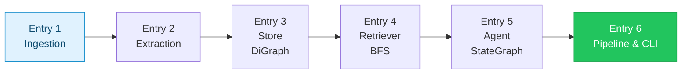
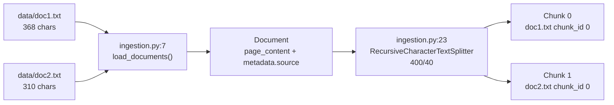
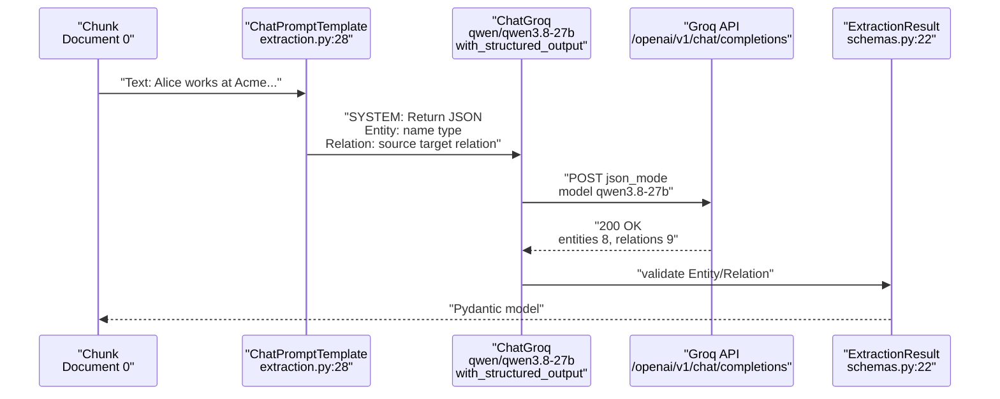
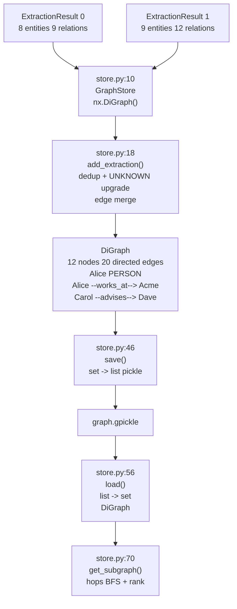
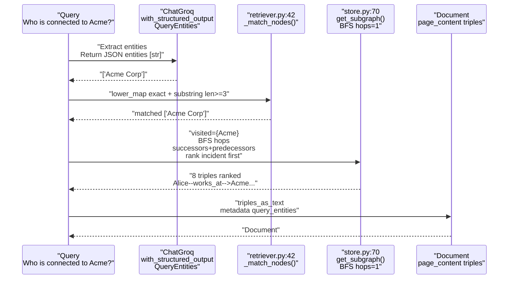
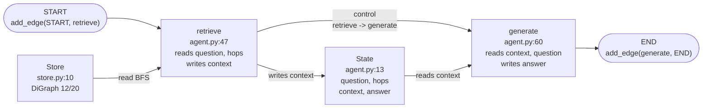
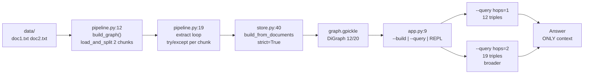

# Graph RAG Learnings — Progress Log
Format: **Concept → Simple explanation → What we built → Result**
**Status:** Entry 1 ✅ · Entry 2 ✅ · Entry 3 ✅ · Entry 4 ✅ · Entry 5 ✅ · Entry 6 ✅

<details><summary>🧭 TOC — 6 entries + deep-dives</summary>

- [Entry 1: Ingestion — Load & Chunk](#entry-1-ingestion--load--chunk-)
- [Entry 2: Extraction — Structured LLM](#entry-2-extraction--structured-llm-)
- [Entry 3: Store — DiGraph Merge](#entry-3-store--digraph-merge-)
- [Entry 4: Retriever — Entity Link + BFS](#entry-4-retriever--entity-link--bfs-)
- [Entry 5: Agent — LangGraph StateGraph](#entry-5-agent--langgraph-stategraph-)
- [Entry 6: Pipeline & CLI — End-to-End](#entry-6-pipeline--cli--end-to-end-)

</details>



---

## Entry 1: Ingestion — Load & Chunk ✅
**File:** `src/graph_rag/ingestion.py`

### Concept
LLMs have finite context windows (8k–32k tokens). Raw docs must be split into overlapping `Documents` with metadata (`source`, `chunk_id`) so downstream extraction stays within token limits and provenance is preserved.

### Simple explanation
Cut two books into index cards. Each card keeps a note of which book it came from and its card number. You never give the whole book to the AI, you give one card at a time.



### What we built
| Piece | Role |
|-------|------|
| `ingestion.py:7 load_documents()` | `Path.glob("*.txt")` → `Document` with `metadata.source`, validates `data_dir` exists |
| `ingestion.py:23 split_documents()` | `RecursiveCharacterTextSplitter(400,40, separators)` + per-source `Counter` for `chunk_id` |
| `config.py:5 Settings` | `chunk_size`, `chunk_overlap` from `.env` |

### Result
```bash
$ source .venv/bin/activate && python -c "from graph_rag.ingestion import load_and_split; print(len(load_and_split()))"
2 chunks -> [('doc1.txt', 0), ('doc2.txt', 0)] ✅

$ python -c "from graph_rag.ingestion import load_documents; load_documents('nonexistent')"
FileNotFoundError: data_dir not found: /.../nonexistent ✅  # validation works
```

### Key takeaways
- `Document` is LangChain's carrier — text + metadata travels together through the chain.
- Per-source `chunk_id` prevents global sequencing bugs when scaling to 100 files.
- Overlap 40 preserves sentence boundaries across card edges.

---

## Entry 2: Extraction — Structured LLM ✅
**File:** `src/graph_rag/extraction.py`

### Concept
Graph RAG's core: LLM reads a chunk and extracts `entities` (nodes with `PERSON/ORG/LOCATION/CONCEPT`) and `relations` (directed edges `source --relation--> target`) via **structured output**. `ChatGroq.with_structured_output(ExtractionResult, json_mode)` enforces Pydantic schema instead of fragile `json.loads`.

### Simple explanation
Give each index card to a smart student (qwen3.8-27b) with a form: "list all people/places and who does what to whom, return JSON only." The student must fill `name/type` and `source/target/relation` exactly.



### What we built
| Piece | Role |
|-------|------|
| `schemas.py:7 Entity` | `name: str` + `Literal PERSON/ORG/LOCATION/CONCEPT` + `extra="ignore"` tolerates LLM `id` hallucination |
| `extraction.py:7 SYSTEM_PROMPT` | Contains `json` word (required for Groq `json_mode`) + example `{"name":"Alice"}` + `source must be NAME not ID` |
| `extraction.py:18 get_extraction_chain()` | `ChatGroq(temperature=0, max_tokens=800, groq_api_key) -> with_structured_output -> prompt | structured` |

### Result
```bash
$ python -c "from graph_rag.ingestion import load_and_split; from graph_rag.extraction import extract_from_text; r=extract_from_text(load_and_split()[0].page_content); print(len(r.entities), len(r.relations))"
doc1.txt chunk 0 -> 8 entities, 9 relations ✅
  E: Alice (PERSON), Acme Corp (ORG), Quantum Computing team (ORG), Bob (PERSON)...
  R: Alice --works_at--> Acme Corp, Alice --leads--> Quantum Computing team...

doc2.txt chunk 0 -> 9 entities, 12 relations ✅
  R: Carol --teaches_at--> Stanford University, Carol --advises--> Dave...

$ HTTP Request: POST https://api.groq.com/openai/v1/chat/completions "HTTP/1.1 200 OK" ✅
# prior barebones failed: 400 "'messages' must contain 'json'" + validation "Extra inputs id not permitted" — both fixed by prompt + extra="ignore"
```

### Key takeaways
- `json_mode` requires word `json` in prompt — Groq enforces it.
- `extra="ignore"` on `Entity/Relation` is intentional tolerance; root `ExtractionResult` stays `forbid`.
- Structured output eliminates manual `json.loads` + retry loops.

---

## Entry 3: Store — DiGraph Merge ✅
**File:** `src/graph_rag/store.py`

### Concept
Merge per-chunk extractions into a single **directed graph** (`DiGraph`). Nodes deduplicated by `name`, `sources` set tracks provenance, edges merged with `relation` concatenation. `DiGraph` preserves direction (`Alice→Acme` ≠ `Acme→Alice`) unlike `Graph`. Pickle serializes for minimal demo (note prod would use JSON/GraphML).

### Simple explanation
Pin all index-card notes onto one whiteboard. If "Alice" appears on two cards, you use one pin. Arrows have direction: Alice *works at* Acme, not the reverse. You photograph the board (`graph.gpickle`) to reload later.



### What we built
| Piece | Role |
|-------|------|
| `store.py:16 DiGraph` | `nx.DiGraph()` preserves `source->target` semantics |
| `store.py:18 add_extraction()` | Node dedup + `UNKNOWN` type upgrade + edge relation merge `", "` |
| `store.py:40 build_from_documents()` | `zip(..., strict=True)` validates `len(docs)==len(results)` |
| `store.py:46 save/load` | Pickle `set->list` conversion + `isinstance(g, DiGraph)` guard for old pickles |

### Result
```bash
$ python app.py --build
Loaded 2 chunks from data
  Extracting doc1.txt chunk 0 -> 8 entities, 9 relations
  Extracting doc2.txt chunk 0 -> 9 entities, 12 relations
Graph built: {'nodes': 12, 'edges': 20} -> graph.gpickle ✅

$ python -c "from graph_rag.store import GraphStore; s=GraphStore(); s.load(); print(s.stats())"
{'nodes': 12, 'edges': 20} DiGraph ✅

Edges sample:
Alice --[works_at]--> Acme Corp
Carol --[advises, co_authored_paper_with]--> Dave
Stanford University --[located_in]--> California
```

### Key takeaways
- Directed edges matter: `works_at` vs `is_ceo_of` must not be traversable backward.
- `strict=True` catches length mismatches that silent `zip` would hide.
- Pickle is minimal but flagged in docstring for replacement in prod.
- **Ranking fix (deep test 15 scenarios):** `get_subgraph` now distance-ranks (`store.py:112 rank`, BFS `dist`) + `max_triples 15→30`, so `hops 2` retains `Dave --researched--> qec` (was 14 vs 15 truncation bug, now 12 vs 19).

---

## Entry 4: Retriever — Entity Link + BFS ✅
**File:** `src/graph_rag/retriever.py`

### Concept
User query is free text → LLM extracts `query_entities` via structured output (`QueryEntities`), fuzzy-match maps them to graph nodes (case-insensitive, `len>=2` guard, `len>=3` substring), BFS `hops` steps from matched nodes collects `max_triples` to form context. Implements `BaseRetriever` so it plugs into any LangChain chain as `Document(page_content=triples, metadata={entities, matched})`.

### Simple explanation
Someone asks "Who is connected to Acme?" You first underline the name "Acme Corp", find that pin on the board, then put your finger there and follow all arrows one step (hops=1) or two steps (hops=2). The arrows you touched are the context you give to the answerer.



### What we built
| Piece | Role |
|-------|------|
| `retriever.py:10 QueryEntities` | Pydantic forgiving-free `entities: list[str]` for query parsing |
| `retriever.py:31 _extract_query_entities()` | `self.llm.with_structured_output(QueryEntities, json_mode)` robust vs `json.loads` |
| `retriever.py:42 _match_nodes()` | Exact first, then substring `len>=3` guard prevents `"a"` matching all nodes |
| `retriever.py:61 _get_relevant_documents()` | `store.get_subgraph(matched, hops, max_triples) -> triples_as_text` |

### Result
```bash
$ python -c "from graph_rag.store import GraphStore; from graph_rag.retriever import GraphRetriever; s=GraphStore(); s.load(); r=GraphRetriever(store=s, hops=1); print(r.invoke('Who is connected to Acme Corp?')[0].metadata['matched_nodes'])"
matched ['Acme Corp'] -> 8 triples: Alice--works_at-->Acme, Acme--based_in-->San Francisco ✅

$ python -c "r.invoke('Where is Stanford located?')"
matched ['Stanford University'] -> 3 triples: Stanford --located_in--> California ✅

$ python -c "r.invoke('a')"
entities [] matched [] -> fallback 20 triples (global overview, not all-node match) ✅  # len<2 guard works
```

### Key takeaways
- Structured query extraction + guarded fuzzy match avoids `"a"` storm.
- `hops` is the only tuning knob learners need: `1` = local, `2` = includes Carol→Stanford.
- `BaseRetriever` makes it composable: `retriever | prompt | llm`.

---

## Entry 5: Agent — LangGraph StateGraph ✅
**File:** `src/graph_rag/agent.py`

### Concept
`agent.py:22` builds a `StateGraph(GraphRAGState)` with two nodes: `retrieve` (`agent.py:47 retrieve_node`) and `generate` (`agent.py:60 generate_node`). Edges are `START → retrieve → generate → END`. `GraphRAGState` (`agent.py:13` `{question, query_entities, matched_nodes, context, answer, hops}`) is the data that flows. `retrieve` reads `question/hops` + `Store DiGraph` and writes `context`; `generate` reads `context+question` via `prompt | ChatGroq` and writes `answer`.

### Simple explanation
Relay race with a shared card (State). `START` hands the question to `retrieve`. `retrieve` looks at the Map (`store.py:10` DiGraph) and writes the found notes (`context`) on the card. The card goes to `generate`, which reads the notes + question and writes the answer. Card goes to `END`.



### What we built
| Piece | Role |
|-------|------|
| `agent.py:13 GraphRAGState` | `TypedDict` typed state |
| `agent.py:22 build_agent()` | Loads `GraphStore`, creates `ChatGroq(temperature=0) + ChatPromptTemplate("ONLY context triples")`, builds `StateGraph` |
| `agent.py:47 retrieve_node` | Isolated `GraphRetriever(store, hops)` per invoke — no shared mutation |
| `agent.py:78 get_graph()` | Lazy factory prevents `import graph_rag.agent` from needing `graph.gpickle` |

### Result
```bash
$ python -c "from graph_rag.agent import build_agent; from graph_rag.store import GraphStore; a=build_agent(GraphStore()); a.invoke({'question':'Who is the CEO of Acme Corp?','hops':1})"
Matched ['Acme Corp'] -> Answer: Eve is the CEO of Acme Corp. (triple Acme --is_ceo_of--> Eve) ✅

# hops sensitivity — the core lesson
$ python app.py --query "Who advises Dave and where do they work?" --hops 1
Answer: Carol advises Dave. No Carol workplace in context (12 triples) ✅

$ python app.py --query "Who advises Dave and where do they work?" --hops 2
Answer: Carol advises Dave. Carol works at Stanford University, Dave interns at Acme Corp. (19 triples) ✅

$ python -c "import graph_rag.agent; print(hasattr(graph_rag.agent,'graph'))"
False -> no import-time side effect ✅  # was True before fix
```

### Key takeaways
- `StateGraph` makes the flow inspectable vs ad-hoc `retrieve(); generate()` calls.
- Isolated retriever per node eliminates `hops` race under concurrent `agent.invoke`.
- System prompt `ONLY context triples` is the anti-hallucination guard.

---

## Entry 6: Pipeline & CLI — End-to-End ✅
**File:** `src/graph_rag/pipeline.py`, `app.py`

### Concept
`pipeline.build_graph()` is `load_and_split -> extract loop (try/except per chunk) -> build_from_documents(strict) -> save`. `app.py` is `argparse` CLI: `--build` rebuilds, `--query` single-shot, no args = interactive REPL with `hops <n> <question>` syntax. `logging` + `sys.exit(1)` on `FileNotFoundError` or empty `--query`.

### Simple explanation
One button photographs the books into a map (`--build`), another button asks the map a question (`--query`). If no map exists, it tells you to build first instead of crashing.



### What we built
| Piece | Role |
|-------|------|
| `pipeline.py:12 build_graph()` | Validates `docs` non-empty, per-chunk `try`, `strict` zip, `store.save()` |
| `app.py:9 main()` | `argparse --build --query --hops`, `FileNotFoundError` → `logger.error + exit 1`, interactive `hops 2` prefix parsing |
| `config.py:5 Settings` | All thresholds (`chunk_size 400`, `hops 1`) from `.env` |

### Result
```bash
$ python app.py --build
Loaded 2 chunks from data
  Extracting doc1.txt chunk 0 -> 8 entities, 9 relations
  Extracting doc2.txt chunk 0 -> 9 entities, 12 relations
Graph built: {'nodes': 12, 'edges': 20} -> graph.gpickle ✅

$ python app.py --query "Who is the CEO?" --hops 1
=== ANSWER === Eve is the CEO of Acme Corp.
=== CONTEXT === Alice --[works_at]--> Acme ... (8 triples)
=== META === matched_nodes: ['Acme Corp'] ✅

$ python app.py --query "  "
app.py: error: --query must be non-empty ✅

$ mv graph.gpickle /tmp/ && python app.py --query "test"
ERROR __main__: Graph not found at graph.gpickle — run `python app.py --build` first ✅

$ printf "hops 2 Who advises Dave?\nexit\n" | python app.py
[context 19 triples, hops=2] -> Carol advises Dave, Carol works at Stanford ✅
```

### Key takeaways
- Pipeline's per-chunk `try` means 1 failed Groq call doesn't abort whole build.
- CLI's `FileNotFoundError` path is the learner's first error — now it hints `--build`.
- `hops` as CLI flag makes the `1 vs 2` lesson interactive without code change.

