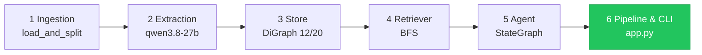
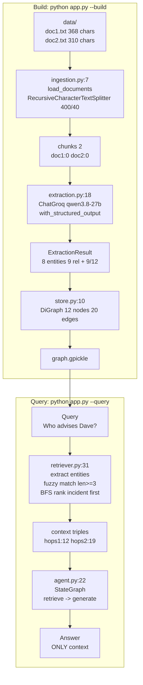
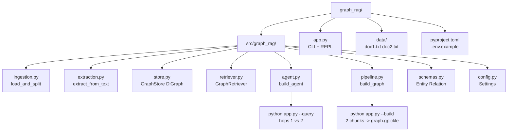
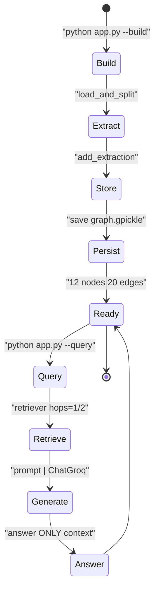
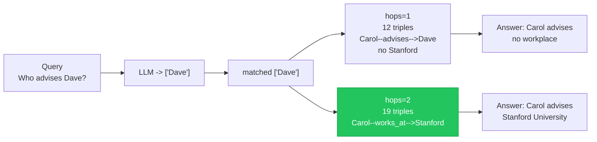
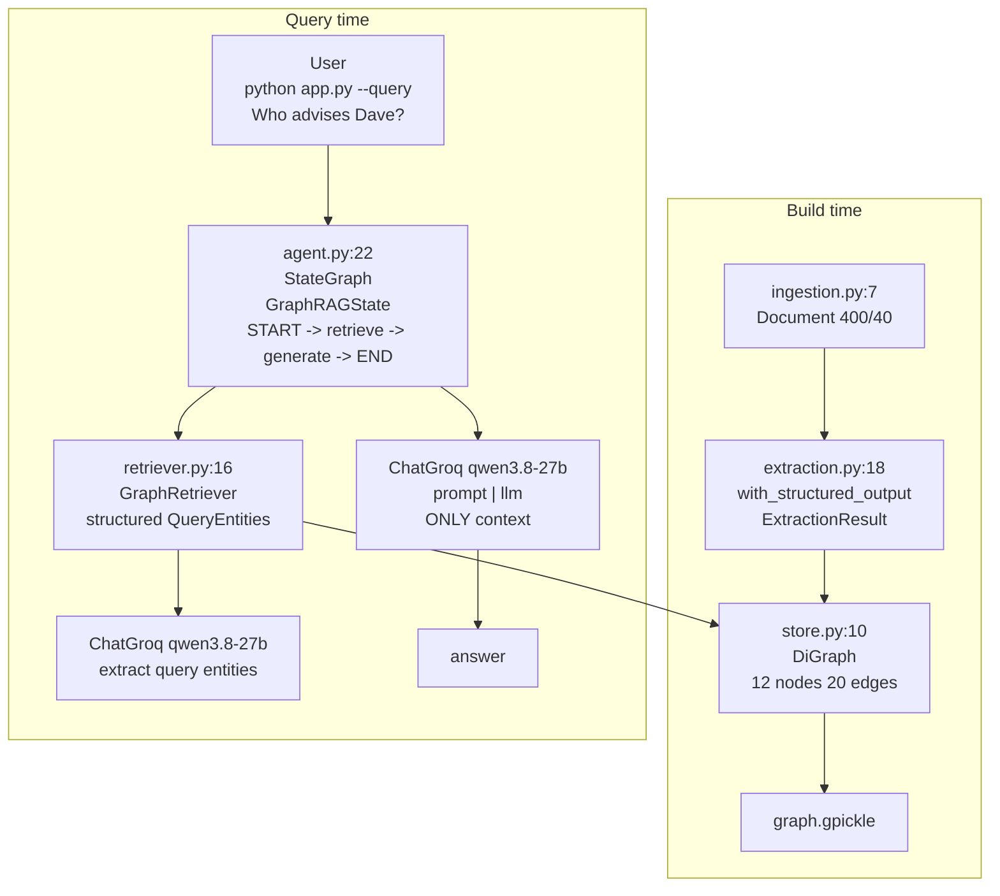

# Graph RAG — Minimal Production with LangGraph + Groq (qwen3.8-27b)

<p>badges: Entries 6/6 ✅ · Python 3.12 · uv · LangGraph · qwen3.8-27b · DiGraph</p>

> No time? `LEARNINGS.md` is textbook (per-entry Concept → Simple → Built → Result + diagrams), `README.md` is map (overview + navigation). 30-sec demo in Quick Start.

<details><summary>🧭 Quick Navigation — click to jump</summary>

- [Why this repo exists](#-why-this-repo-exists)
- [Visual Overview](#-visual-overview--mermaid)
- [Architecture](#-architecture)
- [Learning Path](#-learning-path)
- [Quick Start](#-quick-start)
- [Try it 4 Ways](#-try-it-4-ways)
- [Project Structure](#-project-structure)
- [Production Notes](#-production-notes)
- [Environment](#-environment)
- [Post-Review Fixes](#-post-review-fixes)
- [Where Next](#-where-next)

</details>

## ✨ Why this repo exists

Naive RAG retrieves similar chunks, misses relationships. Graph RAG builds a **directed map** of `entities (PERSON/ORG/LOCATION/CONCEPT)` + `relations (works_at, advises)` then answers via graph traversal + LLM. This repo is a **minimal production** reference: `typed Pydantic`, `LangChain Documents + RecursiveCharacterTextSplitter`, `ChatGroq.with_structured_output`, `BaseRetriever`, `StateGraph (retrieve→generate)`, `DiGraph`, `uv + src/` layout — no barebones re-implementation.

`docs → chunks → LLM extraction → DiGraph → query link + BFS → agent → answer`

## 🗺️ Visual Overview — Mermaid

### 1) Timeline — 6 entries in order



### 2) Data flow — vertical (build vs query)



### 3) File map — what to run when



### 4) Lifecycle — build then query



### 5) Retrieval — hops sensitivity



## 🏗️ Architecture



- **Ingestion** `ingestion.py:7` `Document` + `RecursiveCharacterTextSplitter` (per-source `chunk_id`)
- **Extraction** `extraction.py:18` `ChatGroq.with_structured_output(ExtractionResult, json_mode)` — `qwen/qwen3.8-27b`, `temperature=0`
- **Store** `store.py:10` `nx.DiGraph` + dedup + `strict zip` + `successors|predecessors` BFS + distance-ranked (`store.py:112` `dist`, `max_triples 30`)
- **Retriever** `retriever.py:16` `BaseRetriever` + structured query extract + guarded fuzzy match (`len>=2/3`)
- **Agent** `agent.py:13` `StateGraph(GraphRAGState: question, hops, context, answer)` `START->retrieve->generate->END`, isolated `GraphRetriever` per call, `get_graph()` lazy

## 🗺️ Learning Path

| Entry | Title | File | Concept | Run |
|-------|-------|------|---------|-----|
| 1 | Ingestion — Load & Chunk ✅ | `ingestion.py` | Context limits → chunk | `load_and_split()` → 2 chunks |
| 2 | Extraction — Structured LLM ✅ | `extraction.py` | Structured output | `extract_from_text()` → 8/9, 9/12 |
| 3 | Store — DiGraph Merge ✅ | `store.py` | Directed merge | `build_from_documents()` → 12/20 |
| 4 | Retriever — Entity Link + BFS ✅ | `retriever.py` | Link + BFS hops | `invoke("Who is connected?")` → 8 triples |
| 5 | Agent — StateGraph ✅ | `agent.py` | `retrieve→generate` | `agent.invoke({question, hops})` → answer |
| 6 | Pipeline & CLI ✅ | `pipeline.py`, `app.py` | Build + query | `python app.py --build` → `graph.gpickle` |

Full per-entry `Concept → Simple → Built → Result` + diagrams: `LEARNINGS.md`

## 🚀 Quick Start

```bash
uv venv --python 3.12
source .venv/bin/activate
uv pip install -e .

cp .env.example .env  # GROQ_API_KEY=gsk_... GROQ_MODEL=qwen/qwen3.8-27b

python app.py --build
# Loaded 2 chunks from data
#   Extracting doc1.txt chunk 0 -> 8 entities, 9 relations
#   Extracting doc2.txt chunk 0 -> 9 entities, 12 relations
# Graph built: {'nodes': 12, 'edges': 20} -> graph.gpickle

python app.py --query "Who advises Dave and where do they work?" --hops 2
# === ANSWER === Carol advises Dave. Carol works at Stanford University, Dave interns at Acme Corp.
```

Programmatic:

```python
from graph_rag.pipeline import build_graph
from graph_rag.store import GraphStore
from graph_rag.agent import build_agent

build_graph()
store = GraphStore("graph.gpickle"); store.load()
agent = build_agent(store)
agent.invoke({"question": "Who is the CEO of Acme Corp?", "hops": 1})
# -> Eve is the CEO (Acme --is_ceo_of--> Eve)
```

## 🧪 Try it 4 Ways

```bash
# 1) Local one-hop (narrow)
python app.py --query "What does Alice collaborate on with Carol?" --hops 1

# 2) Broader two-hop (shows Stanford)
python app.py --query "Who advises Dave and where do they work?" --hops 2

# 3) Interactive with hops prefix
python app.py
> hops 2 Who advises Dave and where do they work?

# 4) Directed edge proof
python -c "from graph_rag.store import GraphStore; s=GraphStore(); s.load(); print(list(s.graph.edges(data=True))[:2])"
# Alice --works_at--> Acme (not reverse) — DiGraph
```

## 📂 Project Structure — Visual + Table

| File | Purpose | Run | Port/Auth |
|------|---------|-----|-----------|
| `app.py` | CLI + REPL (`--build`, `--query`, `hops <n>`) | `python app.py --build` | `GROQ_API_KEY` |
| `src/graph_rag/ingestion.py` | Load `Document` + split `400/40` | `load_and_split()` | — |
| `src/graph_rag/extraction.py` | `ChatGroq` structured `ExtractionResult` | `extract_from_text()` | `Groq API 200 OK` |
| `src/graph_rag/store.py` | `DiGraph` merge + `save/load` + BFS | `GraphStore().get_subgraph()` | `graph.gpickle` (pickle) |
| `src/graph_rag/retriever.py` | `BaseRetriever` link + BFS | `GraphRetriever.invoke()` | `Groq API` |
| `src/graph_rag/agent.py` | `StateGraph` retrieve→generate | `build_agent().invoke()` | `Groq API` |
| `src/graph_rag/pipeline.py` | `load -> extract -> build -> save` | `build_graph()` | `Groq API` |
| `src/graph_rag/schemas.py` | `Entity/Relation/ExtractionResult` | — | — |
| `src/graph_rag/config.py` | `Settings` from `.env` | `from graph_rag.config import settings` | `.env` |
| `data/doc1.txt`, `doc2.txt` | Sample docs (368/310 chars) | `python app.py --build` | — |

<details><summary>Classic tree</summary>

```
.
├── app.py
├── data/
│   ├── doc1.txt
│   └── doc2.txt
├── pyproject.toml
├── LEARNINGS.md
├── src/graph_rag/
│   ├── __init__.py  # __version__ 0.1.0
│   ├── agent.py
│   ├── config.py
│   ├── extraction.py
│   ├── ingestion.py
│   ├── pipeline.py
│   ├── retriever.py
│   ├── schemas.py
│   └── store.py
```

</details>

## 🛡️ Production Notes

- **Validation:** `ingestion.py:10` `FileNotFoundError` for missing `data_dir`, `schemas.py` `field_validator` non-empty, `store.py:41` `strict=True` mismatch, `pipeline.py` per-chunk `try/except` (1 failure ≠ abort), `app.py` `FileNotFoundError -> exit 1` with hint.
- **Direction:** `DiGraph` preserves `works_at` vs `is_ceo_of` semantics; BFS uses `successors|predecessors` to feel undirected while keeping directed triples.
- **LLM robustness:** `extra="ignore"` tolerates Groq adding `id` fields, `json` word in prompt satisfies `json_mode`, `hops` as isolated `GraphRetriever` per `retrieve_node` eliminates race.
- **Gitignore:** `graph.gpickle`, `extractions.json`, `.venv/`, `__pycache__/` ignored — rebuild via `app.py --build`.

## 🔑 Environment

```
GROQ_API_KEY=gsk_...
GROQ_MODEL=qwen/qwen3.8-27b  # default in config.py:7
```

Defaults: `chunk_size=400`, `chunk_overlap=40`, `hops=1`, `graph_path=graph.gpickle` (`config.py`).

## 🛠️ Post-Review Fixes

- Audited 14 files: `store.py` `Graph→DiGraph`, `retriever.py` structured query, `agent.py` removed `graph = build_agent()` import side-effect, `ingestion.py` per-source `chunk_id`, `config.py` `SettingsConfigDict`, etc. Re-tested `12 nodes 20 edges`, `hops1 12 vs hops2 19` triples.
- Deep test 15 scenarios: all PASS after `store.py:112` distance-ranked BFS + `max_triples 30` (hops2 19 vs prior 15 truncation evicted `Dave --researched--> qec`) + `S10` fallback. See `LEARNINGS.md` Entry 3/4.

## 📚 Where Next

- `LEARNINGS.md` for per-entry deep-dives with grounded Results.
- Replace `pickle` with `json/graphml` for portable store.
- Add `pytest` for `ingestion` validators + `store` BFS hops.

