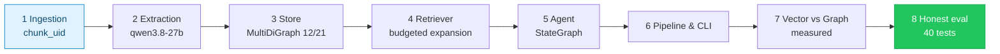
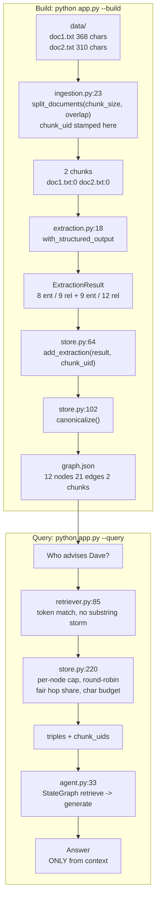
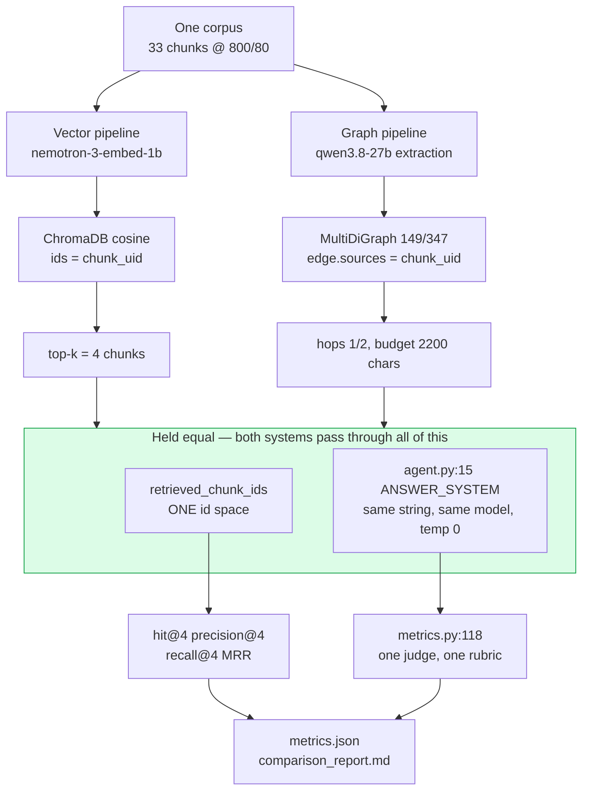
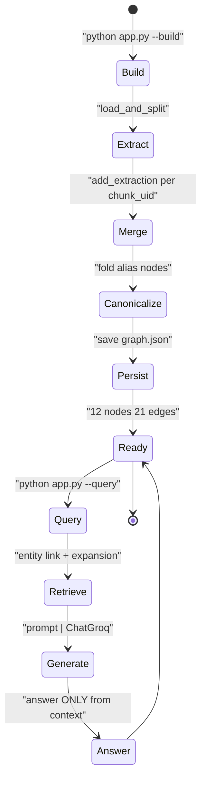
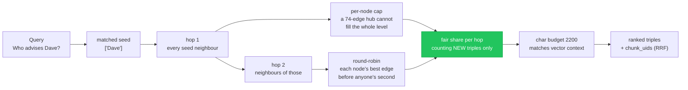
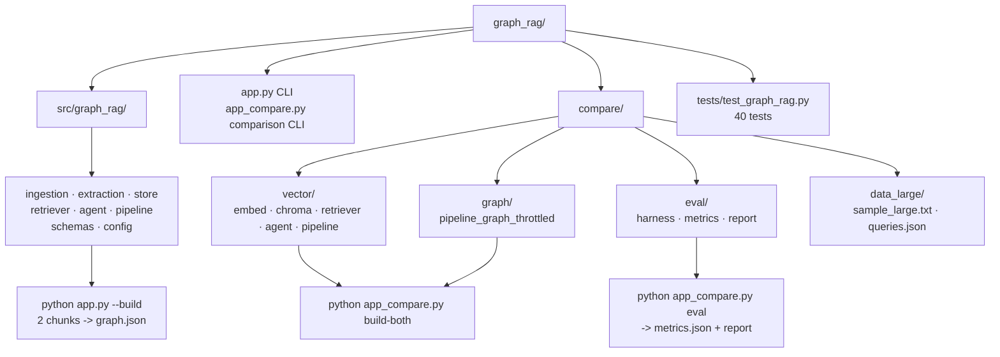
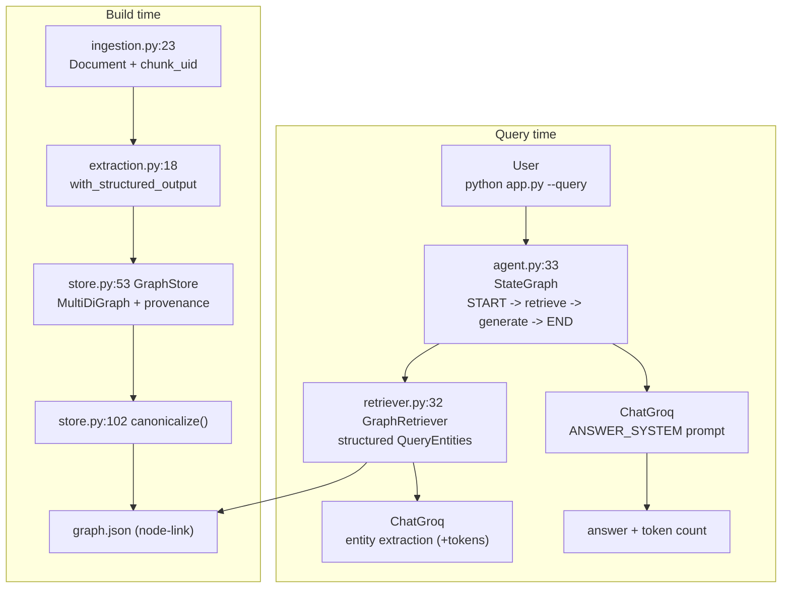

# Graph RAG — Minimal Production with LangGraph + Groq (qwen3.8-27b)

<p>badges: Entries 8/8 ✅ · 40 tests ✅ · Python 3.12 · uv · LangGraph · qwen3.8-27b · NetworkX MultiDiGraph · ChromaDB · NVIDIA Embeddings</p>

> No time? `LEARNINGS.md` is the textbook (per-entry Concept → Simple → Built → Result + diagrams), `README.md` is the map. 30-second demo in Quick Start.
>
> Every figure in both files comes from a committed artifact: `compare/eval/metrics.json`, `compare/eval/build_stats.json`, `compare/comparison_report.md`, or `pytest`.

<details><summary>🧭 Quick Navigation — click to jump</summary>

- [Why this repo exists](#-why-this-repo-exists)
- [Visual Overview](#️-visual-overview--mermaid)
- [Architecture](#️-architecture)
- [Learning Path](#️-learning-path)
- [Quick Start](#-quick-start)
- [Try it 4 Ways](#-try-it-4-ways)
- [Vector vs Graph Comparison](#️-vector-vs-graph-comparison)
- [Project Structure](#-project-structure--visual--table)
- [Tests](#-tests)
- [Production Notes](#️-production-notes)
- [Environment](#-environment)
- [Post-Review Fixes](#️-post-review-fixes)
- [Where Next](#-where-next)
- [Open Issues](issues.md)

</details>

## ✨ Why this repo exists

Naive RAG retrieves similar chunks and misses relationships. Graph RAG builds a **directed map** of `entities (PERSON/ORG/LOCATION/CONCEPT)` and `relations (works_at, advises)`, then answers by traversing it. This repo is a **minimal production** reference — typed Pydantic, LangChain `Document`s, `ChatGroq.with_structured_output`, `BaseRetriever`, `StateGraph`, NetworkX `MultiDiGraph`, `uv + src/` layout — and then it does the thing most Graph RAG demos skip: **measures itself against a vector baseline on the same corpus, and reports the result even though the graph loses.**

`docs → chunks → LLM extraction → MultiDiGraph → entity link + budgeted expansion → agent → answer`

## 🗺️ Visual Overview — Mermaid

### 1) Timeline — 8 entries in order



### 2) Data flow — build vs query



### 3) Apples-to-apples — what is held equal



### 4) Lifecycle — build then query



### 5) Retrieval budgets — why a hub cannot win



### 6) File map — what to run when



## 🏗️ Architecture



- **Ingestion** `ingestion.py:23` — `RecursiveCharacterTextSplitter`, per-source `chunk_id` **and** globally unique `chunk_uid`; chunk parameters are threaded through, not dropped.
- **Extraction** `extraction.py:18` — `ChatGroq.with_structured_output(ExtractionResult, json_mode)`, `qwen/qwen3.8-27b`, `temperature=0`.
- **Store** `store.py:53` — `nx.MultiDiGraph` so parallel relations survive; `sources` sets hold `chunk_uid` provenance; `canonicalize()` folds alias nodes; JSON node-link persistence (no pickle).
- **Retriever** `retriever.py:32` — `BaseRetriever`, structured query-entity extraction, token-overlap node matching, budgeted expansion, emits `retrieved_chunk_ids`.
- **Agent** `agent.py:33` — `StateGraph(GraphRAGState)` `START→retrieve→generate→END`, retrievers cached per `(hops, k)`, per-query token accounting.

## 🗺️ Learning Path

| Entry | Title | File | Concept | Run |
|-------|-------|------|---------|-----|
| 1 | Ingestion — Load & Chunk ✅ | `ingestion.py` | Context limits → chunks + `chunk_uid` | `load_and_split()` → 2 chunks |
| 2 | Extraction — Structured LLM ✅ | `extraction.py` | Schema-enforced output | `extract_from_text()` → 8/9, 9/12 |
| 3 | Store — MultiDiGraph + Provenance ✅ | `store.py` | Parallel edges, alias folding, JSON | `python app.py --build` → 12 nodes / 21 edges |
| 4 | Retriever — Entity Link + Budgeted Expansion ✅ | `retriever.py` | Token match + hop/node/char budgets | `GraphRetriever.invoke()` |
| 5 | Agent — StateGraph ✅ | `agent.py` | `retrieve→generate` + token accounting | `agent.invoke({question, hops, k})` |
| 6 | Pipeline & CLI ✅ | `pipeline.py`, `app.py` | Build + query, paired failure recovery | `python app.py --build` → `graph.json` |
| 7 | Vector vs Graph — Measured ✅ | `compare/` | Dense vs symbolic, held equal | `python app_compare.py eval` |
| 8 | Making the Comparison Honest ✅ | `compare/eval/`, `tests/` | Fixing the exam before trusting the score | `pytest` → 40 passed |

Full per-entry `Concept → Simple → Built → Result` + diagrams: `LEARNINGS.md`

## 🚀 Quick Start

```bash
uv venv --python 3.12
source .venv/bin/activate
uv pip install -e .

cp .env.example .env  # GROQ_API_KEY=gsk_...   (NVIDIA_API_KEY only for the comparison)

python app.py --build
# Loaded 2 chunks from data
#   Extracting doc1.txt:0...
#     -> 8 entities, 9 relations
#   Extracting doc2.txt:0...
#     -> 9 entities, 12 relations
# Graph built: {'nodes': 12, 'edges': 21, 'chunks': 2} (0 aliases merged) -> graph.json

python app.py --query "Who advises Dave and where do they teach?" --hops 2
# === ANSWER === Carol advises Dave, and Carol teaches at Stanford University.
```

Programmatic:

```python
from graph_rag.agent import build_agent
from graph_rag.pipeline import build_graph
from graph_rag.store import GraphStore

build_graph()
store = GraphStore("graph.json"); store.load()
agent = build_agent(store)
agent.invoke({"question": "Who is the CEO of Acme Corp?", "hops": 1})
# -> "Eve is the CEO of Acme Corp."
```

## 🧪 Try it 4 Ways

```bash
# 1) Local one-hop (narrow) — 6 triples, no workplace
python app.py --query "Who advises Dave?" --hops 1

# 2) Two-hop (reaches the advisor's workplace)
python app.py --query "Who advises Dave and where do they teach?" --hops 2

# 3) Interactive, with the hops prefix
python app.py
> hops 2 Who advises Dave and where do they teach?

# 4) Parallel relations proof — MultiDiGraph keeps both
python -c "from graph_rag.store import GraphStore; s=GraphStore(); s.load(); print([(u,k,v) for u,v,k in s.graph.edges(keys=True)][:4])"
# ('Alice', 'works_at', 'Acme Corp') ... direction and relation label both preserved
```

## ⚖️ Vector vs Graph Comparison

`compare/` runs both systems over **one** corpus — `sample_large.txt`, 18k chars, **33 chunks at 800/80, all of them indexed** — and scores them identically.

**What is held equal:** the corpus and its chunking; the generation model (`qwen/qwen3.8-27b`, `temperature=0`); the prompt (`ANSWER_SYSTEM` is *imported* by the vector agent, not copied); the context budget (2196 vs 2205 average characters); the retrieval budget (`k=4` chunks scored for both); and the judge — one rubric, both systems, run on `openai/gpt-oss-120b`, a **different model family from the generator** so neither system is graded by its own producer.

Latency is reported as measured but varies several-fold with provider load between runs; treat the ordering as meaningful and the absolute values as not.

**What differs:** retrieval only — cosine top-*k* over dense embeddings versus entity linking plus graph expansion.

### Results — from `compare/eval/metrics.json`

| Metric | Vector (k=4) | Graph hops=1 | Graph hops=2 |
|---|---|---|---|
| Hit@4 | **100.0%** | 64.3% | 57.1% |
| Precision@4 | **33.9%** | 23.2% | 19.6% |
| Recall@4 | **83.3%** | 47.6% | 44.0% |
| MRR | **0.839** | 0.393 | 0.369 |
| Answer keyword recall | **100.0%** | 57.1% | 57.1% |
| Judge: correct (answerable) | **100.0%** | 50.0% | 42.9% |
| Judge: grounded (all) | **100.0%** | 93.8% | **100.0%** |
| Judge coverage (rows scored) | **100.0%** | **100.0%** | **100.0%** |
| Abstained on answerable | **0.0%** | 42.9% | 50.0% |
| Abstained on negative | **100.0%** | **100.0%** | **100.0%** |
| Avg context chars | 2196 | 1474 | 2205 |
| Avg latency (s) | **0.37** | 0.57 | 0.67 |
| Avg Groq tokens/query | **552** | 610 | 838 |

Retrieval metrics average over the 14 answerable queries; the 2 negative queries are scored on abstention instead of being handed a free 1.0.

### Build cost — from `compare/eval/build_stats.json`

| | Vector | Graph |
|---|---|---|
| Chunks indexed | 33 / 33 | 33 / 33 |
| API calls | 5 (NVIDIA, batched) | 33 (Groq, one per chunk) |
| Wall clock | 8.2s | 175.3s |
| Index | 2.25 MB ChromaDB | 149 nodes / 347 edges JSON |
| Canonicalization | — | 7 aliases merged (156 → 149 nodes) |

### By query type — `hit@4` / judge-correct

| Type | n | Vector | Graph hops=1 | Graph hops=2 |
|---|---|---|---|---|
| factual_single | 4 | 100% / 100% | 25% / 75% | 0% / 75% |
| multi_hop | 4 | 100% / 100% | 100% / 75% | 100% / 50% |
| relationship | 3 | 100% / 100% | 100% / 33% | 100% / 33% |
| semantic | 3 | 100% / 100% | 33% / 0% | 33% / 0% |
| negative | 2 | n/a / 100% | n/a / 100% | n/a / 100% |

### What the numbers actually say

- **Vector wins every retrieval and answer metric on this corpus**, including groundedness (100% vs 93.8% / 100%). Under an independent judge it answers all 14 answerable queries correctly.
- **The graph's failure mode is mostly silence, not invention.** It declines to answer 43–50% of answerable questions, and is ungrounded on exactly one row (q8 at hops=1, 93.8% grounded; hops=2 is 100%). For a system where a wrong answer costs more than no answer, that is a different — and sometimes preferable — risk profile.
- **The graph is competitive exactly where the theory says it should be.** On multi-hop and relationship queries it retrieves a gold chunk 100% of the time, matching vector. It collapses on `factual_single` (a factual query seeds a hub, whose 74 edges dilute the provenance ranking) and on `semantic` (aggregate questions offer no entity to seed from).
- **More hops is worse, not better.** hops=2 *degrades* recall@4 by 3.6 points (47.6% → 44.0%) and judged correctness by 7.1 points (50.0% → 42.9%), while costing +229 tokens per query. A fixed budget spent further from the seed buys weaker evidence.
- **Build cost is the widest gap:** 21× the wall clock and 6.6× the API calls, because every chunk needs an LLM extraction.
- **The honest recommendation is hybrid:** vector for candidate retrieval, graph for explicit relation expansion over those candidates, one LLM to synthesise. Neither strategy dominates the other's strong cases.

### Run it

```bash
python app_compare.py check-quotas    # free-tier estimate from the real corpus + query set
python app_compare.py build-both      # vector ~8s, graph ~175s (throttled, resumable)
python app_compare.py eval            # -> compare/eval/metrics.json + compare/comparison_report.md
python app_compare.py eval --no-judge # retrieval only, skips the judge entirely
python app_compare.py check-quotas    # token-bound estimate from measured usage
python app_compare.py report          # regenerate the report without re-running the eval
python app_compare.py query "Who advises Dave Kim and where do they work?" --hops 2
```

Full per-query breakdown, judge reasoning on every disagreement, and derived findings: **`compare/comparison_report.md`**.

## 📂 Project Structure — Visual + Table

| File | Purpose | Run | Needs |
|------|---------|-----|-------|
| `app.py` | CLI + REPL (`--build`, `--query`, `--hops`) | `python app.py --build` | `GROQ_API_KEY` |
| `app_compare.py` | Comparison CLI (`build-both`, `eval`, `report`, `query`) | `python app_compare.py eval` | `GROQ_API_KEY`, `NVIDIA_API_KEY` |
| `src/graph_rag/ingestion.py` | Load `Document`s + split + `chunk_uid` | `load_and_split(dir, size, overlap)` | — |
| `src/graph_rag/extraction.py` | `ChatGroq` structured `ExtractionResult` | `extract_from_text()` | Groq API |
| `src/graph_rag/store.py` | `MultiDiGraph` + provenance + canonicalize + budgeted expansion | `GraphStore().get_subgraph()` | `graph.json` |
| `src/graph_rag/retriever.py` | `BaseRetriever` entity link + expansion | `GraphRetriever.invoke()` | Groq API |
| `src/graph_rag/agent.py` | `StateGraph` retrieve→generate | `build_agent().invoke()` | Groq API |
| `src/graph_rag/pipeline.py` | `load → extract → build → canonicalize → save` | `build_graph()` | Groq API |
| `src/graph_rag/schemas.py` | `Entity / Relation / ExtractionResult` | — | — |
| `src/graph_rag/config.py` | `Settings` from `.env` | `from graph_rag.config import settings` | `.env` |
| `data/doc1.txt`, `doc2.txt` | Demo docs (368 / 310 chars) | `python app.py --build` | — |
| `compare/vector/` | Embeddings, Chroma, retriever, agent, pipeline | `build_vector_store()` | `NVIDIA_API_KEY` |
| `compare/graph/` | Throttled, resumable graph build | `build_graph_throttled()` | `GROQ_API_KEY` |
| `compare/eval/` | Harness, metrics, report generator | `run_eval()` / `generate_report()` | Groq API (judge) |
| `compare/*/__init__.py` | Makes `compare` a real package, not a namespace one | — | — |
| `compare/data_large/` | 18k-char corpus, 16 test queries + 16 dev queries | — | — |
| `tests/test_graph_rag.py` | 40 regression tests | `python -m pytest -q` | — |

<details><summary>Classic tree</summary>

```
.
├── app.py
├── app_compare.py
├── pyproject.toml
├── README.md
├── LEARNINGS.md
├── data/
│   ├── doc1.txt
│   └── doc2.txt
├── src/graph_rag/
│   ├── __init__.py
│   ├── agent.py
│   ├── config.py
│   ├── extraction.py
│   ├── ingestion.py
│   ├── pipeline.py
│   ├── retriever.py
│   ├── schemas.py
│   └── store.py
├── compare/
│   ├── comparison_report.md      # committed evidence
│   ├── data_large/
│   │   ├── sample_large.txt
│   │   └── queries.json
│   ├── vector/
│   │   ├── embed_nvidia.py
│   │   ├── store_chroma.py
│   │   ├── retriever_vector.py
│   │   ├── agent_vector.py
│   │   └── pipeline_vector.py
│   ├── graph/
│   │   ├── pipeline_graph_throttled.py
│   │   └── graph_large.json      # committed evidence
│   └── eval/
│       ├── harness.py
│       ├── metrics.py
│       ├── report.py
│       ├── metrics.json          # committed evidence
│       └── build_stats.json      # committed evidence
└── tests/
    └── test_graph_rag.py
```

</details>

## 🧪 Tests

```bash
python -m pytest -q
# 40 passed
```

`run_eval` and `build_vector_store` accept injected agents / embedding clients, so the whole evaluation loop runs offline against stubs — `test_run_eval_end_to_end_offline` asserts one agent call per (query, system), which is the bug the original harness had.

Each test is named after the defect it prevents, not after the function it calls — `test_chunk_size_is_actually_applied`, `test_hub_does_not_starve_the_second_hop`, `test_negative_queries_get_no_free_retrieval_credit`, `test_query_set_gold_labels_exist_in_the_indexed_corpus`. Coverage spans ingestion parameters, `MultiDiGraph` parallel edges, relation and name normalization, canonicalization (including the ambiguous case it must *not* merge), JSON round-trip, retrieval budgets, chunk-provenance fusion, every metric, and the query set's gold labels.

## 🛡️ Production Notes

- **Validation:** `ingestion.py:10` rejects a missing `data_dir`; `schemas.py` `field_validator` rejects empty names; `store.py:93` `zip(strict=True)` catches length mismatch; `pipeline.py:13` keeps `(doc, result)` paired so one failed chunk cannot misattribute all later ones; `app.py` turns a missing graph into `exit 1` with a hint.
- **Security:** the graph is JSON node-link and the embedding cache is JSON — neither is `pickle`, which executes arbitrary code on load and sits behind a settings-configurable path.
- **Free-tier discipline:** embeddings batch at 8 with a 1.5s sleep and honour `Retry-After` on 429; graph extraction throttles at 2.5s/chunk and checkpoints per `chunk_uid`, so an interrupted build resumes exactly where it stopped.
- **Held-out evaluation:** `queries.json` is the test set the published metrics measure; `queries_dev.json` is a disjoint dev set for tuning retrieval, so a ranking change cannot be chosen on the queries used to report it.
- **Answer and judge caching:** answers are cached under a fingerprint of the graph, the vector index and the generation model, so a rebuild invalidates them; verdicts are cached by model + question + reference + context + answer, so re-running an unchanged configuration costs nothing on the judge model — 54k of an eval's 86k tokens.
- **Token-aware pacing:** the eval and the graph build limit themselves on a rolling 60-second window of requests *and* tokens. Tokens are the real constraint — an unpaced run sits at ~17k tokens/min against an 8k TPM cap, and every resulting 429 is retried at the cost of one of the 1000 daily requests. A paced run takes ~11 minutes; `check-quotas` reports the honest ceiling of 3 evals/day, bound by the judge model's daily token budget.
- **Direction and multiplicity:** `MultiDiGraph` preserves both `works_at` vs `is_ceo_of` direction and the fact that one pair of entities can hold several relations. Expansion walks `successors | predecessors` while keeping the triples directed.
- **Committed evidence:** `metrics.json`, `build_stats.json`, `comparison_report.md` and `graph_large.json` are in git. The Chroma index, embedding cache and checkpoint are ignored — those rebuild from the corpus.

## 🔑 Environment

```
GROQ_API_KEY=gsk_...
GROQ_MODEL=qwen/qwen3.8-27b            # default in config.py
JUDGE_MODEL=openai/gpt-oss-120b        # eval judge; deliberately a different family
NVIDIA_API_KEY=nvapi_...               # comparison only
NVIDIA_EMBED_MODEL=nvidia/nemotron-3-embed-1b
```

Defaults (`config.py`): `chunk_size=400`, `chunk_overlap=40`, `hops=1`, `graph_path=graph.json`; comparison defaults `compare_chunk_size=800`, `compare_chunk_overlap=80`, `compare_max_chunks=0` (index everything), `compare_k=4`, `compare_max_triples=60`, `compare_max_context_chars=2200`.

## 🛠️ Post-Review Fixes

A full audit of the comparison found that the first published table measured the harness more than the retrieval. What changed:

| Area | Defect | Fix |
|---|---|---|
| Ingestion | `load_and_split` ignored chunk parameters; a 40-chunk cap dropped **43% of the corpus** | Parameters threaded through; cap defaults to 0 (index everything) |
| Scoring | Vector scored against gold *chunks*, graph against gold *entity names* — two id spaces, one table | Both emit `retrieved_chunk_ids`; one id space |
| Metrics | `context_precision` split on `.` (triples have none → binary); `faithfulness` was word overlap (punishes triple syntax); `correctness` was exact substring (scored right answers 0) | `precision@k` over chunk ids; `keyword_recall` on word boundaries; one shared LLM judge |
| Metrics | Empty gold sets returned a vacuous `1.0`, giving every system free points | Answerable and negative queries aggregated separately |
| Harness | Retriever *and* agent both retrieved → 2× cost, inflated latency, metrics from a different retrieval than the answer | One `agent.invoke` per (query, system) |
| Fairness | Graph answered from 958 chars against vector's 2196 | Character budget — now 2205 vs 2196 |
| Graph store | `DiGraph` collapsed parallel relations; dedup was a substring test; provenance was the filename | `MultiDiGraph`, normalized relation keys, `chunk_uid` provenance |
| Retrieval | Raw substring matching seeded 30 nodes from `quantum`; induced-subgraph edges let one hub fill the budget; hop-2's share was spent on duplicates | Token matching, traversed-edge-only expansion, per-node cap, round-robin, dedup-aware share |
| Pipeline | `docs[:len(results)]` misattributed every chunk after a failure; checkpoint keyed by filename made resume skip everything | Paired `(doc, result)`; checkpoint keyed by `chunk_uid` |
| Reporting | `eval` never called `generate_report`; the report's prose contradicted its own tables | CLI wires the report; every line is derived from `metrics.json` |
| Judging | The judge ran on the same model as the generator, grading its own output style | `judge_model` defaults to `openai/gpt-oss-120b`, a different family |
| Judging | A judge API error was recorded as `correct=False, grounded=False` — in one run *every* ungrounded row was really a JSON validation failure | Judge retries, then the row is left unscored and excluded from the means; `judge_coverage` reports how many |
| Coverage | Zero tests | 40 regression tests, one per defect |

Detail, with before/after numbers, is in `LEARNINGS.md` Entry 8.

## 📚 Where Next

Known limitations, deferred work and methodological caveats are tracked in **`issues.md`**.

- Hybrid retrieval: vector for candidates → graph expansion over those chunks → single synthesis. The per-type table shows the two strategies fail on disjoint query types, which is the precondition for a hybrid to beat both.
- Query-aware triple ranking beyond the current lexical signal — an embedding similarity between the question and each candidate triple would target the `factual_single` hub-dilution loss directly.
- Entity resolution beyond the two deterministic passes: `Stanford` is deliberately left unmerged because it prefixes two real entities, and that ambiguity costs measurable recall.
- Scale the corpus past 33 chunks to see whether vector's lead narrows as the graph's relation density grows.
